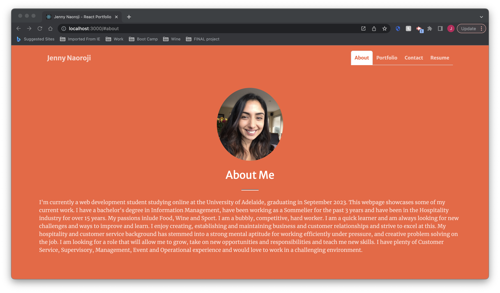
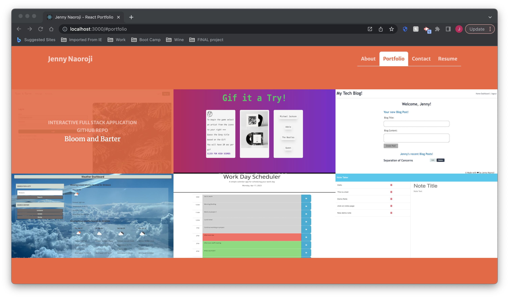
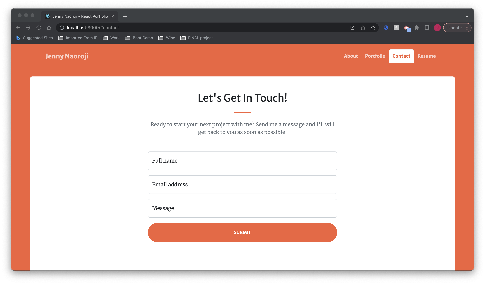

# 20 React: Jenny Naoroji React Web Development Portfolio

## Description

My Task was to build a React Portfolio Application where I can share my projects whilst applying for jobs or working as a freelancer and set myself apart from developers who don't use the latest technologies. This will also give me the ability to share my work with other developers and collaborate on projects.

This application will be deployed to GitHub Pages and will fulfill the following User Story and Acceptance Criteria:

## User Story

```md
AS AN employer looking for candidates with experience building single-page applications
I WANT to view a potential employee's deployed React portfolio of work samples
SO THAT I can assess whether they're a good candidate for an open position
```

## Acceptance Criteria

```md
GIVEN a single-page application portfolio for a web developer
WHEN I load the portfolio
THEN I am presented with a page containing a header, a section for content, and a footer
WHEN I view the header
THEN I am presented with the developer's name and navigation with titles corresponding to different sections of the portfolio
WHEN I view the navigation titles
THEN I am presented with the titles About Me, Portfolio, Contact, and Resume, and the title corresponding to the current section is highlighted
WHEN I click on a navigation title
THEN I am presented with the corresponding section below the navigation without the page reloading and that title is highlighted
WHEN I load the portfolio the first time
THEN the About Me title and section are selected by default
WHEN I am presented with the About Me section
THEN I see a recent photo or avatar of the developer and a short bio about them
WHEN I am presented with the Portfolio section
THEN I see titled images of six of the developer’s applications with links to both the deployed applications and the corresponding GitHub repositories
WHEN I am presented with the Contact section
THEN I see a contact form with fields for a name, an email address, and a message
WHEN I move my cursor out of one of the form fields without entering text
THEN I receive a notification that this field is required
WHEN I enter text into the email address field
THEN I receive a notification if I have entered an invalid email address
WHEN I am presented with the Resume section
THEN I see a link to a downloadable resume and a list of the developer’s proficiencies
WHEN I view the footer
THEN I am presented with text or icon links to the developer’s GitHub and LinkedIn profiles, and their profile on a third platform (Stack Overflow, Twitter)
```


## Usage

To use this application visit the deployment link on GitHub Pages!
- https://jnaoroji.github.io/React_portfolio_JN 

## Credits

- [Create React App Docs on GitHub Pages](https://create-react-app.dev/docs/deployment/#github-pages) 

- [Bootstrap Icons](https://icons.getbootstrap.com/)
- [Bootstrp Portfolio Templates](https://themes.getbootstrap.com/)
- [Bootstrap Portfolio & Resume Themes](https://startbootstrap.com/themes/portfolio-resume)
- [Bootstrap Cards](https://getbootstrap.com/docs/4.0/components/card/)
- [Bootstrap avatars](https://mdbootstrap.com/docs/standard/extended/avatar/)
- [React input](https://react.dev/reference/react-dom/components/input)
- [React forms](https://legacy.reactjs.org/docs/forms.html)
- Mock up demo:


## Screenshots
These screenshots show my app's functionality:
- The About Me Page: 


- The Portfolio Page: 


- The Contact Page: 



## License

[](https://opensource.org/licenses/MIT)
Please refer to the LICENSE in the repo or click on the badge for documentation.
